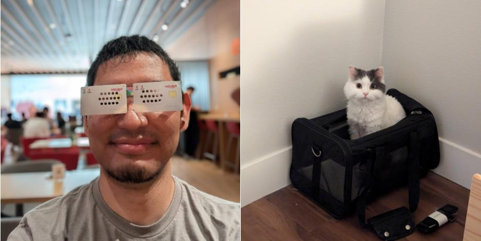

/// caption
最近のdraftcodeと帰国準備ができている猫
///

何人かには話していましたが、2015年にアメリカに引っ越してきてから早10年、2025年の
2月末ごろに本帰国することにしました。

## 帰国を決める経緯など

パンデミックなり加齢であったりで「家族や友人関係に優先順位を振りたい」と感じる
ことが多くなってきたというのが主な理由です。あまり人に話していませんが、
パンデミック前後で立て続けに家族や友人関係・仕事関係で死別のイベントが複数回
ありました。死別まではいかなくとも、長期間ICUにはいったままになってしまった
友人もいました。自分とそこまで歳が変わらない人も亡くなっており、自分自身の残りの
人生というものを意識することも増えました。仕事の関係・経済的理由・政治的信条に
よって、遠くに引っ越してしまったり、疎遠になった友人もいます。そんなこんなで、
アメリカでの人間関係が結構希薄になってしまったと感じています。他方で、妹に子供が
生まれて叔父になったり、なぜか日本で友人関係が広がったりもしました。となると、
アメリカにいるよりも日本に帰ったほうが、家族や友人関係は充実し、自分の人生で
トータルで見るとそちらのほうが幸せかなという結論になりました。

じゃあいつ帰るの、という話になるのですが、猫と一緒に帰ることを考えると、
猫ができるだけ若いうちに帰ったほうが身体への負担が少ないだろうということで、
なにかを待たずに今帰っていいか、という判断になりました。帰国して当面は横浜の
実家にいる予定ですが、猫は両親ともに顔合わせなどはしているので、無事に到着
出来たら、多少なりとも知っている環境だといいなと思います。自分が実家で
暮らしていたころは犬を飼っていたのですが、実は父親は猫派だったので、今から楽しみ
にしているようです。

## 仕事は？

今の会社の日本子会社を新しく作って、そちらで働くことになりました。一緒に働く
ソフトウェアエンジニアも募集します。
